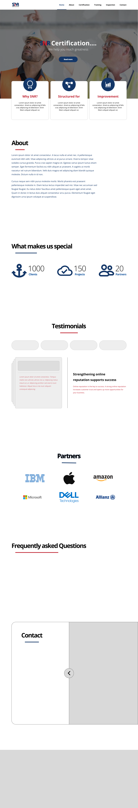
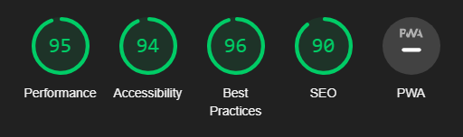

# SNR Certificate

This is an HTML/CSS template used to develop the skill of coding web projects for a real company just in case we started working on a freelancing gig or got that task.

I also wanna mention that it was the only project that got over 2 versions, as well as it being the first website I designed, built and deployed.

**I learned:**

- Sass good writing principles
- How to use bootstrap effectively
- How to deploy a website
- How to organize my website
- How to design a webpage
- How to choose a color palette

## Figma

I used **Figma** for design and also I added those design files in the design folder.
I added a mobile responsive part as well.

### Font Family

- **Open sans**
  I chose a sans-serif font to add simplcity and smooth appeal to the design.
  I also self-hosted this font-family to avoid internet connection conflicts

Add Font family preview image here...

### Colors

- main_color: #143768
- secondary_color: #bf1e2d
- accent-color: #eee

### Type Scale

font-size: 10px

**Font Sizes**

- --fz-1: 48px
- --fz-2: 32px
- --fz-3: 26px
- --fz-4: 18px
- --fz-5: 14px

**Large Screens**

- --fz-1: 64px
- --fz-2: 48px
- --fz-3: 32px
- --fz-4: 18px
- --fz-5: 16px

### Screen Supported

- Desktop >= 1200px
- Mobile < 768px
- Tablets <= 991px

### Icons

I used **Font Awesome** for icons.
and Bootstrap for Web components

## FrontEnd

This website is a single page app and doesn't need any API or backend work. which is why it doesn't have any routing, API calls or any backend frameworks or JS framework. Just a simple vite project for bundling modules.

### Technologies used

- HTML&CSS
- JS
- Bootstrap
- Vite
- Sass

### Features

- Simple Animations
- Pagination
- Dropdown menu

## BackEnd

This website doesn't have any backend work.

## Deployment

I used **Github pages** to deploy this project.  

### [SNR](https://snr-certificate.netlify.app)

## Responsiveness

This website is responsive for all screen sizes.

## Testing

I used **Lighthouse** to test the performance of the website.

